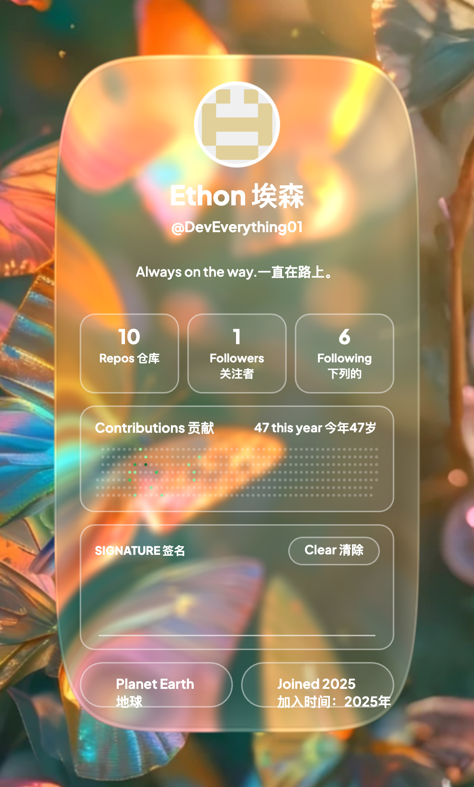

<div align="center">



<br/>
<br/>

<!-- Header -->


<br/>

```
 ██████╗ ███████╗██╗   ██╗    ███████╗██╗   ██╗███████╗██████╗ ██╗   ██╗████████╗██╗  ██╗██╗███╗   ██╗ ██████╗ 
 ██╔══██╗██╔════╝██║   ██║    ██╔════╝██║   ██║██╔════╝██╔══██╗╚██╗ ██╔╝╚══██╔══╝██║  ██║██║████╗  ██║██╔════╝ 
 ██║  ██║█████╗  ██║   ██║    █████╗  ██║   ██║█████╗  ██████╔╝ ╚████╔╝    ██║   ███████║██║██╔██╗ ██║██║  ███╗
 ██║  ██║██╔══╝  ╚██╗ ██╔╝    ██╔══╝  ╚██╗ ██╔╝██╔══╝  ██╔══██╗  ╚██╔╝     ██║   ██╔══██║██║██║╚██╗██║██║   ██║
 ██████╔╝███████╗ ╚████╔╝     ███████╗ ╚████╔╝ ███████╗██║  ██║   ██║      ██║   ██║  ██║██║██║ ╚████║╚██████╔╝
 ╚═════╝ ╚══════╝  ╚═══╝      ╚══════╝  ╚═══╝  ╚══════╝╚═╝  ╚═╝   ╚═╝      ╚═╝   ╚═╝  ╚═╝╚═╝╚═╝ ╚═══╝ ╚═════╝ 
```

<br/>

<a href="https://github.com/DevEverything01"></a>
&nbsp;
<a href="https://github.com/DevEverything01?tab=repositories"></a>
&nbsp;
<a href="https://github.com/DevEverything01"></a>

</div>

<br/>

<div align="center">

```
┌──────────────────────────────────────────────────────────────────┐
│                                                                  │
│   > SYSTEM INIT...                                               │
│   > LOADING NEURAL MODULES...                                    │
│   > AI AGENT FRAMEWORK .......... [██████████] READY             │
│   > LLM FINE-TUNING ENGINE ...... [██████████] READY             │
│   > FULL-STACK RUNTIME .......... [██████████] READY             │
│   > DESKTOP AGENT OS ............ [████████░░] IN PROGRESS       │
│   >                                                              │
│   > ALL SYSTEMS OPERATIONAL.                                     │
│                                                                  │
└──────────────────────────────────────────────────────────────────┘
```

</div>

<br/>

## `> whoami`

```yaml
name: DevEverything01
role: Full-Stack Engineer & AI Agent Builder
location: China
philosophy: "Build everything. Understand everything. Ship everything."
```

一个对 **AI Agent** 与 **大模型应用** 充满执念的工程师。

从底层框架到上层应用，从模型微调到智能体编排，我相信最好的 AI 产品来自于对每一层的深刻理解。

<br/>

## `> cat /tech/stack.json`

<div align="center">

| 领域 | 技术栈 |
|:---:|:---|
| **🧠 AI / LLM** | `LLM Fine-Tuning` · `RAG` · `Agent Architecture` · `MCP Protocol` · `Prompt Engineering` |
| **⚡ Backend** | `Go` · `Python` · `Java / Spring Boot` · `Node.js` |
| **🖥 Frontend** | `React` · `TypeScript` · `Electron` · `Vite` |
| **🔧 Infra** | `Docker` · `Linux` · `System Monitoring` · `CI/CD` |
| **📡 Interests** | `Autonomous Agents` · `Desktop AI` · `Digital Humans` · `Open Source` |

</div>

<br/>

## `> ls ~/projects/ --highlight`

<table align="center">
<tr>
<td width="50%" valign="top">

### 🤖 OmniPilot
> *本地优先的桌面智能代理*

隐私友好、OS 感知的 macOS 桌面 Agent。以自然语言驱动跨应用工作流编排，让 AI 真正成为你的操作系统级副驾。

`Electron` `TypeScript` `LLM`

</td>
<td width="50%" valign="top">

### 🧬 刘慈欣数字人
> *与科幻巨匠的数字对话*

基于大模型微调构建的刘慈欣数字化身，支持深度探讨科幻、文学、科技与人类未来的交互式对话系统。

`Fine-Tuning` `Python` `RAG`

</td>
</tr>
<tr>
<td width="50%" valign="top">

### 🧠 Memory Agent
> *一个能记住你一切的智能助理*

融合 Mem0 短期记忆 + RAGFlow 长期记忆 + Qwen 大模型，打造真正具有持久记忆能力的个人 AI 助手。

`Mem0` `RAGFlow` `Qwen`

</td>
<td width="50%" valign="top">

### 📊 系统监控面板
> *玻璃拟态风格的实时监控*

基于 React 18 + Vite 的现代化服务器集群监控仪表盘，深色玻璃拟态设计，实时数据流与异常告警。

`React` `Vite` `WebSocket`

</td>
</tr>
<tr>
<td colspan="2" align="center" valign="top">

### 🏗️ 数据加工厂 · LLM 微调数据工具链
> *从原始数据到 SFT 就绪的全流程*

ShareGPT 格式转化 → 数据扩展 → 质量分析 → 微调就绪。面向 LLM 微调场景的完整数据工程方案。

`Python` `Data Pipeline` `ShareGPT`

</td>
</tr>
</table>

<br/>

## `> cat /dev/philosophy`

```
╔════════════════════════════════════════════════════════════════╗
║                                                                ║
║   "The best way to predict the future is to build it."         ║
║                                                                ║
║   我不只是使用 AI 工具，                                         ║
║   我构建它们。                                                   ║
║                                                                ║
║   从模型层到应用层，从 Agent 框架到桌面产品，                      ║
║   每一层都值得被深入理解、被优雅实现。                              ║
║                                                                ║
╚════════════════════════════════════════════════════════════════╝
```

<br/>

## `> neofetch`

<div align="center">


</div>

<br/>

<div align="center">


</div>

<br/>

## `> tail -f /var/log/connect.log`

<div align="center">

<a href="mailto:BorgWrightpcalac@outlook.com"></a>
&nbsp;
<a href="https://github.com/DevEverything01"></a>

</div>

<br/>

<div align="center">

```
> CONNECTION ESTABLISHED
> SIGNAL STRENGTH: ████████████ 100%
> READY TO COLLABORATE
```

<br/>


</div>
